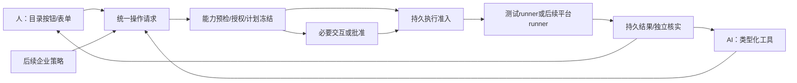

# 桌面自助服务与人/AI 统一受控执行客户端 PRD

本文件定义产品目标、用户旅程和安全要求，不作为实现或验证进度表。任务状态与依赖在 [EPIC #2392](https://dev.azure.com/shengming0923/rss/_workitems/edit/2392) 维护；运行操作见[桌面指南](../guides/desktop-development.md)，固定来源见[来源索引](../reference/sources.md)。

## 1. 产品定位与完成边界

用户可以不使用 AI 完成已授权的软件和工具操作，也可以让 AI 发现同一目录、建议操作并在委托范围内调用。
客户端使用同一个请求、能力预检、授权、批准、执行与证据链，操作来源不能改变其权限上限。
最终形态包括普通用户桌面应用、可独立运行的后台服务、用户会话辅助与按需特权 runner；完整生产后台执行与正式发布安装仍需后续阶段。

| 阶段 | 产品结果 | 完成门 |
| --- | --- | --- |
| S0：本次需求基线 | 本 PRD、来源、任务追踪与 EPIC 实施顺序 | 文档内容/链接/追踪一致；不声明软件能力完成 |
| S1：C01–C20 控制链 | 独立核心、AI/UI 提取、真实 SQLite/协议接缝、测试执行器下人和 AI 共用操作 | 明确标识测试执行；不产生受管目标的脚本/软件/配置变更；测试DB、模型进程/网络等基础设施副作用需记录 |
| S2：本机真实执行 | 选定 OS 上的受控原生脚本、一个安装器、用户上下文与服务恢复 | 先完成本地信任根与授权签发，再验收平台/身份/产物及取消恢复；缺本地authority时仅允许实验室验证，不作为终端用户自助发布 |
| S3：企业远程接线 | 正式目录分配、设备注册、策略、远程任务、回执、可信升级 | 消费 rss-mdm wire/artifact，完成限定产品 T3；后续 PBI |

S1 中一个“软件项目”和一个“脚本工具”只是目录与控制流程的测试实例，不表示软件已安装或系统已修复。
S1 不要求所有 AI 引擎完成才验证首个闭环：C20 选择 Codex；Claude/DeepSeek Harness 各自交付适配能力，不伪称未经验证的引擎具有同等控制能力。

本批不实现：真实 PowerShell/Bash 或包安装、生产特权执行、Agent 远程注册/领取、MDM 变更派发、系统更新、可信升级、后台自动重启部署、真实设备 T3。
不迁入 PR 监控、仓库扫描、Webhook、review 调度、标签/评论、PR 去重/数据库、PR deep link/CLI、远程终端或消息集成。
不加入 EDR、驱动、远程桌面、任意权限插件市场、通用 IAM 或通用制品仓库。

## 2. 用户与核心旅程

| 用户 | 可获得的价值 | 权限边界 |
| --- | --- | --- |
| 终端用户 | 浏览软件/工具、填参数、申请或执行、看结果、处理重启提示 | 自助点击不自动获得管理员权限 |
| 运维人员 | 发布受控工具、诊断、选择任务、查看获准的详细证据 | 发布、批准、执行权限分别判定 |
| 管理员/批准者 | 管理目录与委托、批准超出预授权的具体操作 | 批准必须绑定主体、目标、计划和期限 |
| AI 助手 | 查询事实、推荐目录项、构造候选、在委托内提交 | AI 是发起来源，不是新的权限 authority |

### J1：人主动安装或修复软件

用户打开软件中心，选择目录项目与允许的操作，查看明确的版本、目标、运行身份和交互要求。
客户端预检后执行、申请批准或说明阻塞；已满足期望时不重复安装。用户从任务中心获得持久进度与核实结果。
企业必装软件是否允许卸载由可信政策决定，不因按钮可见或 AI 推荐而改变。

### J2：人主动运行工具

用户选择“网络诊断”等发布工具，填写由目录 schema 生成的表单，提交受约束参数。
后台使用精确脚本版本、解释器和运行上下文；退出状态与诊断证据分别展示。
S1 全程使用无系统副作用的测试执行器，界面必须持续显示该事实。

### J3：AI 诊断并调用同一个工具

AI 查询可见目录和已授权事实，选择同一工具、相同参数 schema，调用预览/提交接口。
人和 AI 共用裁决：Allowed 无需额外批准；仅 ApprovalRequired 产生批准请求；Denied 直接拒绝，批准不能覆盖拒绝。批准拒绝或过期保持不执行，AI 不能回答自己的批准请求。
AI 的总结引用真实任务/证据，脚本或工具输出不被提升为新的系统指令或授权。

### J4：新脚本、等待用户与恢复

AI 或获准用户提交新脚本候选，形成不可变产物；批准绑定精确字节/参数/目标/权限。
需要关闭应用、保存工作或选择维护时间时，独立交互状态机保存等待原因。
UI 关闭或 AI 会话结束不等于任务取消；重启后从 journal 恢复。副作用不明时先核实，不盲重跑。

## 3. 仓库、身份与权威边界

| owner | 拥有 | 消费边界 |
| --- | --- | --- |
| rss-mdm-agent | 本 PRD、独立执行核心、AI adapter、客户端 UI、后续本地 journal/runner/安装升级 | 独立 Cargo/pnpm workspace；已存在执行纯核心与桌面展示壳，能力按各 owner 验收 |
| rss-mdm | Device/Registration、企业 Group/Scope/Policy/Resource、源发布、产品授权、Agent wire producer | 不在客户端复制第二套业务权威；跨仓使用精确版本/hash artifact |
| rss-identity | 管理主体认证与产品身份交接 | CLI/模型登录、OS 登录不能替代产品身份认证 |
| prmonitor | 本次 AI/UI 提取的固定来源 | 不链接整个 prmonitor_lib、不迁移 PR 数据；不要求来源仓先重构或删除能力 |
| RSS | 已接纳的公共持久化/执行机制 | 按实际公开能力复用；本批不向 RSS 自动新增通用 crate |

Agent wire 的唯一 producer 仍为 rss-mdm；`execution-contract` 是本地执行值类型和约束，不是另一套远程注册/任务协议。
产品组装负责 wire 与本地类型的显式映射；不得以 DTO 转换成功证明可信身份或执行授权成立。
跨仓消费固定 artifact 身份/版本/摘要和锁文件，不使用相邻目录 path，不建立第三共享仓。

## 4. 功能需求

表中“验收”定义实现完成所需行为，不是当前通过状态。需求编号由本 PRD 唯一维护。

### 4.1 身份与操作来源

| 编号 | 要求 | 验收 |
| --- | --- | --- |
| CLI-ID01 | 区分 actor、initiator（human/ai/policy）、批准者、委托、设备与目标用户 | 修改 initiator 不扩大同一 actor 的操作权限；AI 自报主体被拒绝 |
| CLI-ID02 | AI 连接配置、OS 登录用户、产品主体和特权服务账号分别记录 | Human 必填来源 OS device/account/session，AI 另带 provider 与连接配置 ID/revision；均独立于 actor、target 和 runAs 并参与摘要/审计。模型登录成功或本机用户存在不能构造企业授权；运行用户映射可解释 |
| CLI-ID03 | 本地模式由经OS管理员初始化的本地authority绑定OS主体、目录、政策及批准签发；企业模式消费产品身份和设备注册 | 信任根/签发者与政策版本保存在受保护服务存储，UI/AI不可铸造；缺真实绑定的生产入口拒绝；测试主体仅测试装配可用 |
| CLI-ID04 | 委托绑定主体、动作/资源、目标、期限和预算，不能扩大授权者权限 | 越权目标、过期委托、跨用户/设备/tenant 重放在执行前拒绝 |

### 4.2 软件、脚本与自助目录

| 编号 | 要求 | 验收 |
| --- | --- | --- |
| CLI-CAT01 | CatalogItem 统一表示软件、脚本、工具及其操作变体 | 人和 AI 可引用相同项目、相同版本与动作；不以不同入口复制模板 |
| CLI-CAT02 | 保存名称/分类/说明、平台要求、版本引用、参数 schema、交互与证据要求 | 目录不依赖 Resource 实现，组装后精确引用资源，未解析引用禁止执行 |
| CLI-CAT03 | 参数 schema 同源派生人用表单与 AI 工具参数 | 类型/枚举/长度/默认值/敏感输入规则一致；不同入口错误分类一致 |
| CLI-CAT04 | 可见、可申请、可执行分别建模 | 列表可见或模型 readOnlyHint 不能使后台放行；执行前重新授权 |
| CLI-CAT05 | 支持企业必装、可选自助和申请后可用的分发描述 | 必装卸载/用户已有软件接管由可信政策决定；S1 使用固定策略样本 |
| CLI-CAT06 | 目录下架、版本变更、过期和离线缓存有明确行为 | 缓存可浏览不表示仍获执行权；已批准计划不能自动替换成最新产物 |

### 4.3 传统桌面与交互

| 编号 | 要求 | 验收 |
| --- | --- | --- |
| CLI-UI01 | 提供首页、软件中心、工具/脚本表单、任务中心、交互通知、设备/帮助入口 | 用户不启用 AI 也能完成测试目录提交、申请、查看结果和处理提示 |
| CLI-UI02 | 展示确定性计划摘要、版本、目标、身份、权限、数据/网络范围与计划 ID | AI 摘要仅作补充；未知效果不显示为已核实；敏感参数不可明文回显 |
| CLI-UI03 | 普通用户看到业务说明，脚本正文/详细日志按权限开放 | 目录和结果查询分别授权；用户不能借任务详情读取其他主体内容 |
| CLI-UI04 | 无 PR 导航、数据、路由、后台任务与必填字段 | 在没有仓库/PR 数据时可运行；应用不探测 gh/az/glab 来完成客户端功能 |
| CLI-INT01 | 分离用户确认、隐私同意、管理员授权三类交互 | “已保存文件”不能成为提权批准；批准者由可信上下文确定 |
| CLI-INT02 | 等待用户、补参数、维护窗口、重启提示可以取消/过期 | 迟到/重复回答不改变已提交结果，超时不自动同意特权操作 |
| CLI-INT03 | UI 和 AI 会话生命周期与任务生命周期分离 | 关闭窗口不伪造取消或成功；重开从持久状态恢复待处理交互 |

### 4.4 AI 会话与原生工具调用

| 编号 | 要求 | 验收 |
| --- | --- | --- |
| CLI-AI01 | 通用 Conversation/Message/ToolCall 契约，无 PR 语义 | 不要求 pr_number/repository；流式输出、中断和错误可独立消费 |
| CLI-AI02 | Codex app-server、Claude Agent SDK、DeepSeek Harness 独立适配，共用宿主工具裁决接缝 | 各自固定版本并声明续接/进程 generation/工具控制能力；不以一个引擎证明全部支持 |
| CLI-AI03 | AI 通过目录、能力、预览、候选、提交、状态和取消工具工作 | 无“AI 自行批准”工具；MCP adapter 不直接调用 shell/PTY 或 runner |
| CLI-AI04 | 受控模式禁止继承来源项目自动批准/全权限旁路 | 任意原生工具、直接 shell、本地 IPC 或其他入口可绕过时，受控模式不可用 |
| CLI-AI05 | AI 输出、工具元数据和终端输出都视作不可信数据 | 工具输出中的指令/自报安全等级/自报完成不能创建授权或执行回执 |
| CLI-AI06 | AI 对话恢复与执行恢复分别处理 | 引擎进程重启后不能恢复会话时显示失效；持久执行状态不被清空或再次派发 |

### 4.5 脚本、执行与软件计划

| 编号 | 要求 | 验收 |
| --- | --- | --- |
| CLI-EX01 | 人、AI、策略请求共用能力/授权/批准/执行入口 | 同一主体/委托/计划得到一致裁决，不因来源改变上限 |
| CLI-EX02 | 能力匹配只消费快照，区分 supported/blocked/unsupported/unknown | 解释器、运行用户、权限或沙箱能力未知时不能自动降级无限制运行 |
| CLI-EX03 | 计划冻结精确脚本/安装物、参数、目标、身份、约束、期限和版本 | Windows 环境名拒绝大小写冲突并统一表示；网络端点明确 scheme、规范 DNS/IP host 与非零 port，拒绝 URL 组件和隐式端口。修改任一授权相关字段使摘要或适用性变化，旧批准不再放行 |
| CLI-EX04 | 原生 PS/sh/Bash 作为产物执行，无需 JS/Rust 字符串包装 | C10 只生成固定解释器/argv/cwd/env 描述；参数不拼接进任意 shell 命令 |
| CLI-EX05 | 任意脚本的声明和静态分析不证明其只读或安全 | 沙箱/权限约束必须在实际平台强制；特权新脚本需精确授权 |
| CLI-EX06 | 禁止把收到、排队、进程退出、目标已核实合并成成功 | 无真实进程的测试 runner 只能返回 test evidence，不能形成真实 Applied/Converged |
| CLI-SW01 | 安装计划消费明确期望、检测事实、安装器能力与软件所有权 | 精确 source/package/version/arch/variant，禁止公共同名包或latest隐式回退 |
| CLI-SW02 | 保留包生态的版本、依赖与安装语义 | 不用统一 SemVer 替代 MSI/WinGet/Brew/APT/DNF 的实际版本比较规则 |
| CLI-SW03 | 安装/升级/卸载/等待/重启/检测独立建模 | 退出0不等于版本满足，用户已有/依赖引入/组织托管不被混同 |
| CLI-SW04 | 同一资源写 owner 与包管理器互斥在实际安装阶段强制 | 多来源请求不重复改同一资源；取消安装未知时不能换通道重跑 |

### 4.6 持久化、批准与恢复

| 编号 | 要求 | 验收 |
| --- | --- | --- |
| CLI-REC01 | SQLite 是已接纳本地执行/交互/批准的持久 authority，AuditEvent可关联完整裁决 | 稳定事件ID、authority/tenant与device、request/plan/attempt、actor/initiator/approver、action/resource/target、decision/reason、委托/政策/批准版本、时间及evidence引用；准入裁决审计与intent同事务，失败不调用runner；审计读取单独授权，秘密只存引用或脱敏值 |
| CLI-REC02 | 每次新尝试的批准消耗与执行 intent 原子提交 | 必需profile全部满足；同一记录覆盖多个profile只消费一次。同一attempt重放不重复消费，并发CAS只有一个成功；事务失败不扣减，已提交但失败/未派发不自动退还；intent不是已产生OS副作用的证明 |
| CLI-REC03 | intent之后、执行中、结果保存前的崩溃有明确恢复状态 | 非幂等动作不得盲重跑；先核实、保留未知或转人工处理 |
| CLI-REC04 | 取消请求、超时、进程终止和副作用回滚分别记录 | 取消不保证全进程树终止或系统效果消失；真实平台支持后独立验证 |
| CLI-REC05 | 离线/时钟回拨/授权撤销有界处理 | 无可靠授权时效依据时不接纳新变更；离线不承诺即时撤销，截止及最大窗口明确 |
| CLI-REC06 | 本地DB迁移、容量、磁盘满、锁竞争与损坏有可诊断结果 | 迁移事务化并可从中断恢复；旧客户端遇到更高schema只读诊断并禁止执行/写入；失败保留原库或隔离副本，禁止自动初始化新authority；真实SQLite故障测试覆盖上述边界 |

### 4.7 安全与平台

| 编号 | 要求 | 验收 |
| --- | --- | --- |
| CLI-SEC01 | 生产可信身份/批准值不可由普通DTO或模型输入直接构造 | 私有构造/验证接缝与集成拒绝测试；类型安全不被表述为可抵抗本机管理员篡改 |
| CLI-SEC02 | UI、AI host、MCP和后续CLI/IPC都经过授权服务 | 人工按钮、deep link或本地token不能成为另一路权限入口 |
| CLI-SEC03 | 后续特权代理与普通用户AI/UI隔离，批准在执行前复核 | 不将整个Tauri应用提升为root/System；同用户可读token本身不被视为进程隔离 |
| CLI-SEC04 | 秘密只以受控引用/句柄传递，输出有界并按权限脱敏 | 模型prompt、argv、日志、普通SQLite记录和UI不含长期凭据；AI结果查询也受限 |
| CLI-SEC05 | 渲染不可信消息和脚本输出时不执行HTML/终端控制副作用 | XSS/恶意链接/输出诱导样本不能铸造操作或批准；保留原始证据访问权限 |
| CLI-SEC06 | 本机管理员/内核失陷不在普通客户端隔离保证内 | S1由C18验证测试DB访问边界、C19声明测试身份/能力限制；实际缓存、凭据、DB与IPC平台权限保护在S2/S3验收，不宣称防篡改EDR |
| CLI-OS01 | Windows/macOS/Linux 是客户端宿主设计维度 | 各自构建/测试/打包/真实执行状态单列；无证据的组合不得标为支持 |
| CLI-OS02 | Linux 宿主不自动成为 rss-mdm 受管平台 | Linux注册、systemd、APT/DNF、安装升级与发行版矩阵留后续产品范围与PBI |
| CLI-OS03 | Windows System、Mac root 与登录用户上下文不同 | 后续执行器按任务指定身份；WinGet CLI/Brew限制见来源，不用提权解决所有兼容问题 |
| CLI-OS04 | 后续升级器与被替换进程隔离，保留凭据/journal并验证失败恢复 | 本批仅定义要求；安装签名、公证、升级/卸载/恢复均单独验收 |

## 5. 统一模型和执行边界

最小业务对象：CatalogItem、OperationVariant、ParameterSchema、Conversation、ToolCallProposal、ExecutionRequest、FrozenPlan、ApprovalRecord、ExecutionIntent、Attempt、Evidence、Interaction、AuditEvent。

`actor` 表示承担权限的主体，`initiator` 只记录 human/ai/policy 来源，`delegation` 限制代理范围；另存批准者和目标 OS 用户。
模型账号、OS用户和企业身份不能按相同用户名或email自动合并。
批准用既有完整规范计划摘要绑定目标与身份、产物/参数、授权版本和预算，并绑定记录版本、期限与允许尝试次数；不维护第二套可漂移的字段投影。任何有效范围改变须重新判定。
每次新attempt重新取得C07裁决；只有ApprovalRequired进入C08可信验证接缝。多个必需profile须全部满足，批准可预授多次使用，每次新尝试对每个不同记录消费一次。总时钟与attempt计数从intent原子接纳开始，等待/重试不重置。
纯核心只验证可信输入并输出裁决/消耗意图；真实主体验证、批准签发与原子消耗由指定 adapter/host 完成。
本地authority由OS管理员在后续服务bootstrap中建立：绑定稳定OS主体标识、允许目录与政策，指定有批准权的主体和签发密钥；密钥/政策/撤销版本位于UI/AI不可写的服务存储。
普通用户host只能转交经认证的请求，不能自行声明actor、提高政策或签出批准。本地authority与企业tenant命名空间分离，不伪造企业身份；更换信任根使原批准失效，须有独立接线/负测证据。S1只有显式测试authority。

进入 J 前所有必需批准都必须满足；图中直达 J 的路径仅适用于已有授权且不需新增交互的请求。
AI请求与手动请求都不能自行取得可执行capability。运行模式与runner标识进入记录；测试证据不能被转换成真实执行回执。
输出中的“已完成”文字不是 Evidence；证据由可信执行接缝生成并归属原任务/attempt/计划。

服务类型与执行器分开：Agent/MDM是产品管理通道，HTTPS等是传输，PowerShell/Bash/安装器是执行器，System/root/用户会话是执行上下文。
原生MDM报文与用户工具请求不复用同一wire；其组装映射由rss-mdm负责。

## 6. 组件边界

执行核心不依赖 UI、模型 SDK、数据库或平台业务；通过显式可信输入工作。AI Host 持有产品会话与可靠交付，原生引擎持有模型上下文，Rust 服务持有执行权威。TS 不直接写 Rust 批准、intent 或结果表。

北向使用 ACP 与 A2UI；Codex、Claude、DeepSeek 由各自 adapter 接入，具体能力与操作见[本地 Host](../../apps/ai-host/README.md)。动态依赖关系以 workspace manifest 为准，接口与格式由代码和 schema 持有。

## 7. prmonitor 提取规则

固定来源为 `4dcc87264ad740da6559824e0a8b04a1c2914d4b`；逐文件出处见来源索引，实际提取PR记录原路径、新路径和改写理由。
仅提取AI引擎和UI；源仓保留为参考，本批不要求修改源仓，不迁移用户PR历史或PR配置。

必须改写：`ReviewEngine::start(pr_number, SkillInvocation)`、按PR/skill去重、Review命名事件和store、PR prompt/skill默认入口。
新标识为Conversation/Proposal/ExecutionTask；UI能在无仓库/PR上下文下工作。
移除`approvalPolicy=never`与danger-full-access、Claude bypassPermissions及反向自动批准作为受控默认行为。
历史 Cursor 的 force/sandbox-disabled 同样禁止继承，仅作来源记录，不属于当前 provider 支持矩阵。

AI引擎适配不等于安全执行器。具体引擎若仍能通过内置shell、网络或其他工具绕过宿主约束，必须禁用对应工具或提供实际隔离；无法强制时明确不支持受控模式。
恢复能力按provider/version/process generation描述，不伪装三引擎具有相同跨重启resume。
固定来源根目录未发现LICENSE。C05用户已确认源码为自有项目，允许提取并采用MIT；授权及逐文件改写见来源记录。其它提取仍核对适用权利及第三方NOTICE，不因公开可读就推定许可。

## 8. 运行、安全与故障边界

S1测试runner不产生受管目标的脚本/软件/配置副作用：预设结果、等待、取消和故障注入；真实SQLite文件、AI provider进程/网络/账户及测试临时目录等基础设施活动允许且必须记录范围。
生产入口不能启用测试主体或把test evidence当真实设备结果。S1没有系统helper，不提供任意exec/PTY入口。

后续特权服务通过受保护IPC接收验证后的任务，UI/AI普通权限，执行前复核可信主体、摘要、授权时效和OS前提。
授权服务的签名/状态与模型可写文件隔离；仅隐藏MCP工具或给同用户进程一个token不足以证明无法绕过。
PowerShell/Bash是原生载荷；Rust提供启动、预算、权限、恢复，JS/Wasm是以后按需要引入的可选受限计算，不作为所有脚本必经层。

进程超时、kill、数据库取消只说明各自事实，不保证其它服务承接的副作用终止。恢复须核实，不对任意动作承诺exactly-once。
安装前后检测、包管理器锁、重启、用户已有软件保护、签名/摘要和缓存替换风险在真实执行器阶段提供证据。
离线批准仅在明确且可验证的有效期内使用；时钟回拨/撤销状态不明时默认不接纳新变更，不承诺离线即时撤销。
管理员可配置有界输出/日志/并发/磁盘保留；具体数值由性能与平台实施验证冻结，不在PRD编造容量SLO。
配置带版本，保存前校验硬上限并原子替换；加载失败使用仍满足当前强制政策的last-known-good，或进入禁止新执行的degraded状态，保留诊断、取消请求和安全恢复能力。配置变化审计记录操作者与前后版本；C19验证该接缝，不从PR配置整体迁入。

## 9. 与现有后端路线的衔接

本客户端EPIC与[#2378](https://dev.azure.com/shengming0923/rss/_workitems/edit/2378)、[#2344](https://dev.azure.com/shengming0923/rss/_workitems/edit/2344)建立Related，不整包互设前置。
当前S1的纯核心、源提取与测试闭环不等待真实Windows注册、后端Group/Policy、管理员会话或设备T3。

| 连接点 | 后续实际消费 | 当前边界 |
| --- | --- | --- |
| 目录与脚本/软件产物 | #2383 Resource、#2386发布、#2389后端持久发布 | C03只持引用/条件；不重复审批发布authority |
| 企业必装与目标范围 | 后端Group/Scope/Policy及#2390 API | C11只接收明确期望/可信约束，不在端上重算企业目标 |
| 用户/设备授权 | #2347/#2348及产品身份接入 | S1测试主体不能冒充正式企业identity |
| Agent远程任务 | rss-mdm后续P01版本化wire artifact | producer PR先交付，consumer固定版本/hash；不在C01偷偷定义第二协议 |
| 真机变更/升级/T3 | 各平台后续runner、安装器、注册/发布任务 | 不混入S1控制链完成门 |

现有rss-mdm将完整企业自助列为可选深化；用户本次明确提前建设的是本地人/AI共用目录与控制入口。
本PR不改后端PRD的发布退出条件；企业目录发布、身份/许可、真实软件自助安装和Linux受管能力需在对应后端/平台交付时同步批准范围。

## 10. 交付协作

任务关系与实施顺序由 tracker 持有。共享契约由其 owner 修改，调用方同步切换；同一文件只由一个任务集成。组件测试、产品组装和平台执行分别验证，不把独立组件可用视为整条业务完成。

## 11. 后续平台能力与客户端发布

后续按平台和可验收行为分别登记：本地authority bootstrap/主体绑定/签发与撤销；进程适配；系统服务/IPC/用户上下文；PS/sh/Bash执行器；MSI/WinGet、PKG/Brew、APT/DNF；缓存下载；Agent注册/通信；签名安装/更新/卸载；企业目录/策略接线。
这些工作消费本批核心和具体平台产物，不整体等待全部三平台，也不能因为已有UI而跳过执行验证。

Windows/macOS/Linux分别记录OS版本/edition、CPU架构、解释器/安装器版本、执行身份、会话/隐私权限、隔离能力、打包方式和支持阶段。
Linux首批发行版/init/包生态、Windows版本/架构、Mac机型/版本均未冻结；未选定前只承诺设计适配点。
prmonitor源码或其跨平台依赖不构成本客户端三平台安装包/更新/后台服务的证据。

## 12. 验收与证据分层

| 门 | 必须提供的证据 | 不能替代 |
| --- | --- | --- |
| 文档门（D00） | 唯一需求编号、链接/来源、任务依赖与scope检查，review | 任意功能实现、make ci、打包或T3 |
| 核心门 | 各crate独立构建/行为测试、确定性时间/未知值/预算/错误输入、无无关依赖 | 真实SQLite/模型/OS行为 |
| 适配门 | 真实SQLite事务与故障；MCP/AI协议fixtures；适用的实际provider接缝 | 协议fixture不能证明模型内置工具已被封闭 |
| S1共同闭环门 | 人用UI和选定真实Codex版本的同一测试目录/runner；同请求裁决、恢复、原生工具旁路负测 | 无真实引擎/账户时C20保持未完成，不用模型替身声称完整AI受控闭环 |
| 平台门（S2） | 实际脚本、安装前后检测、身份切换、超时/取消/副作用不明及独立限定T3 | 一个OS/安装器成功不覆盖其它矩阵 |
| 企业门（S3） | 固定服务端wire/artifact、真实注册/授权/撤销/远程结果与T3 | 本地fixture不代表企业身份已接入 |

最小故障矩阵：

- 人/AI不同入口同一主体与委托；无权、过期、跨tenant/设备/用户、批准主体失效、hash/参数替换。
- 从UI、MCP、provider原生工具、本地IPC及深链接尝试旁路；缺能力/强制隔离不可用必须拒绝。
- 参数注入、路径/PATH/环境劫持、符号链接替换、敏感输出、不可信HTML或工具输出诱导。
- 批准消耗前后、intent提交后、runner返回前后、结果保存前后重启；重复消息和取消竞争。
- 用户缺席、窗口关闭、模型退出、会话generation失效、离线、时钟回拨、磁盘满、SQLite锁竞争/损坏、迁移中断、旧客户端打开较新schema。
- 不可关联审计、审计读取越权、无效/越界配置、配置原子替换失败与last-known-good不再满足强制政策。

S1未实现的真实进程/文件/网络/IPC隔离风险在平台门验证，不以测试runner的拒绝性样本冒充系统沙箱证明。
C20必须证明选定AI宿主自身没有不受控原生工具旁路；做不到时停留在普通会话/测试协议能力，不开放受控操作。

验证操作与记录要求见[验证规则](../rules/verification-scope.md)。

## AI 测试用户、连接与上下文（AGENT-AI-01）

[AGENT-AI-01 #2454](https://dev.azure.com/shengming0923/rss/_workitems/edit/2454) 统一桌面测试主体、个人连接和产品会话。用户手动填写或选择名称：Unicode 去首尾空白、NFC 规范化、ASCII 大小写不敏感，1–64 个字符且不含控制字符；保留首次显示名称，以随机内部 ID 持久归属。重启恢复最后选择并生成新 UI generation。此入口始终显示测试模式，不提供防冒用认证。

原生组合根持有用户注册表、当前 generation 和平台凭据入口；WebView 不提交 caller。每用户独立会话、连接、默认/选中偏好与 UI 状态。切换用户关闭旧订阅、清空草稿与回调、取消旧模型队列和运行；未取得 terminal 的工作保留不确定状态。设备任务继续使用冻结原 actor，一个设备执行服务持有同一 journal，用户属于请求上下文而非服务实例；不预建用户执行线程，也不维护按用户服务池。

每用户可创建多条命名 Codex、Claude、DeepSeek 连接。Codex/Claude 统一选择“本机已有配置”：直接传入默认或指定配置目录，官方 CLI/SDK 自行复用登录、解析默认模型与刷新认证，RSS 不识别真实账号、不提取 token、不读取外部 Keychain。自定义 API 在原生输入框输入；Keychain 仅保存一个应用主密钥，API 密钥以 AES-256-GCM 密文保存于现有 SQLite 连接修订行。连接只有 configRevision，没有独立凭据版本或外部账号引用。验证完成且进程停止后，配置、密文和默认偏好同事务保存；失败、取消、冲突或切用户不写入。编辑默认保留密钥；删除清除该连接全部密文与默认选择，保留元数据及历史，不再启动新 worker。首条可用连接成为默认，后续新增不替换默认，删除默认无自动替补。

Native 与 Host 使用匿名继承管道及固定 Caller/generation 的 UI 通道；不监听文件系统 socket。worker 启动参数仅通过既有私有管道传递，不存参数快照或来源账号文件；主密钥不进入 worker。保留工具、hooks、plugins 和任意 MCP 的限制，既有配置不得开放旁路。Codex 验证使用 ephemeral 线程，Claude 使用不持久化的验证会话；仅恢复 RSS 记录的原生 ID，不管理用户其它 CLI 会话。

[#2462](https://dev.azure.com/shengming0923/rss/_workitems/edit/2462) 经用户扩大为 macOS arm64 / Windows 11 x64 独立安全状态服务及桌面候选接线：服务仅 GetServiceStatus，采用 OS 双向身份和连接内一次性 challenge；不采用 HMAC、凭据票据或 worker grant，不接收 AI 密钥。该实现不包含真实脚本、软件安装或生产授权签发，双平台真实验证需独立提供证据。详见[安全服务架构](../architecture/local-service.md)与[实验室验收](../guides/local-service-lab.md)。AES-GCM 随机 IV 保留。测试注入主密钥 backend，不访问真实用户 Keychain。

产品 Session 可在无凭据时创建和读取。首条输入懒创建 provider 阶段，后续连接选择先等待已接收队列按原阶段完成；切换等待期间拒绝新的普通输入。每个阶段固定连接及版本，一次仅有一个 live worker。原生 resume 与新上下文意图分别操作，原命令重试优先返回原回执，不触发新阶段。原生恢复失败不静默换上下文。

跨上下文发送历史默认关闭；用户选择最近 N 轮或全部已完成的用户/助手稳定文本并确认预览。预览冻结目标版本、水位、命令/消息 ID 与内容哈希；不包含工具、系统指令和原始附件，不静默截断或重发。完整历史持续可读。

应用使用 `test-users` 数据根；当前无历史数据，旧账号、凭据及接口直接删除，不实现历史升级、迁移、兼容读取或清理链路。macOS 的来源验收与适配回归分别记录；Windows/Linux 和企业登录/配置下发仍不在已验证能力内。

## 设置与 AI 启动恢复（AGENT-AI-02）

[#2455](https://dev.azure.com/shengming0923/rss/_workitems/edit/2455) 由同一设置入口完成测试用户、个人连接验证保存和新对话。应用壳不依赖已选用户或 AI Host 就绪；高级设置折叠、不可用操作说明原因。主题、系统通知和更新只开放已交付能力。

Native 保留用户、主密钥和唯一设备执行 owner，AI Host 按私有 health 握手进入 ready，可单独受控重启。重连仅恢复视图和核对历史，不重发未知请求；重启不改变设备任务归属或结果。Host 完全不可用时仅保留当前用户本次已加载的授权历史只读，不增加独立数据库 reader；切换用户清空缓存，恢复后从原 Host 分页读取。

health 失败立即撤销私有权限通道并有界回收；回收未知禁止新代准入。Native 重算运行包摘要，并将 `.app` 资源绑定到编译时候选身份；启动/清理诊断与控制出站遵循唯一生成契约。请求错误证据只能归属到对应 dispatch，不能跨请求复用；未知归属不推断为认证失败。

连接验证区分真实错误类别，按所选模型及用途验证；受控工具探针无设备副作用，不以文本回复替代工具能力证据，不静默降级模型。诊断按闭集脱敏并由用户主动导出。当前实现直接替换旧入口，未新增数据库格式、旧接口兼容或迁移链路。无凭据回归、开发/发布资源定位、真实模型分别提供证据，验收操作见[桌面指南](../guides/desktop-development.md)。
